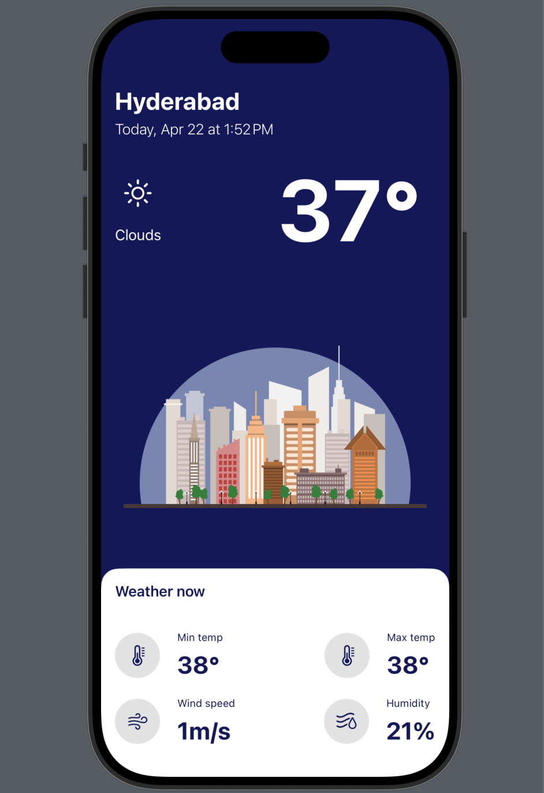

# 🌦️ WeatherApp

This is a simple iOS application built with Swift and SwiftUI that fetches and displays the current weather conditions for a user's location using a weather API.

## 📱 Features

- View current temperature, weather description, and conditions
- Automatic location-based weather updates
- Clean and minimal SwiftUI interface
